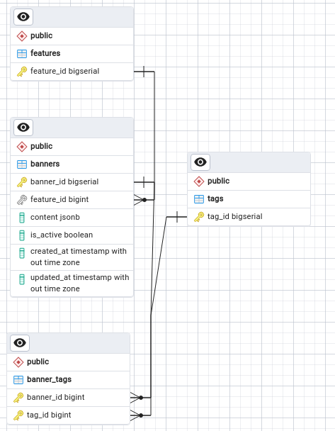

# Тестовое задание на стажировку в Avito

## Запуск проекта и тестов

- Склонировать проект и перейти в папку проекта

```bash 
git clone git@github.com:VitoTyutikov/test_avito.git 
```

- Запуск сервера:

```bash 
make
```

Или

```bash
make run
```

- Запуск тестов для получения баннера для пользователя

```bash
make test
```

- Запуск нагрузочного тестирования

```bash
make load_test
```

- Рестарт сервера

```bash
make restart
```

## Использованные бибилиотеки

- ```GIN``` - http-сервер
- ```gorm``` - ORM
- ```vegeta``` - для нагрузочного тестирования
- ```Docker``` и ```docker-compose``` - для деплоя сервиса
- ```PostgrSQL``` - для БД
- ```github.com/patrickmn/go-cache``` - для кэширования in-memory

## Примечания
- Запросы в Postman: 
```bash
  https://www.postman.com/winter-spaceship-307094/workspace/avito/collection/24758794-42716aa1-7db0-4dbd-9224-bf626dc5e739?action=share&creator=24758794 
```
- Для нагрузочного тестирования использовались 4 типа запросов. Нагрузочное тестирование начиналось с пустым кэшем.
    1. ```/user_banner?tag_id=TAG&feature_id=FEATURE[i]```
    2. ```/banner?tag_id=TAG&feature_id=FEATURE[i]```
    3. ```/banner?tag_id=TAG[i]```
    4. ```/banner?feature_id=FEATURE[i]```,
  где FEATURE = [1,2,3,...,999,1000] и
       TAG = [1,2,3,...,9,10] сгенерированы рандомно.
- Результаты нагрузочного тестирования в [result](tests/load/result.txt). 
- Структура базы данных:



- При запуске сервера в БД создается по 1000 тегов, фичей, баннеров, каждому баннеру принадлежат 10 тегов ([1,2,...,10]).


## Вопросы, появившиеся во время реализации
1. Когда делаем PATCH запрос на обновление баннера, в api.yaml написано "Обновление содержимого баннера", я сразу подумал о поле Content, но при этом в request body указаны также теги, фича. Было два варианта:
   1. Сравнивать фичу и теги что пришли в запросе с тем, что лежит в бд, если полное совпадение, то обновляем контент, время обновления, активность баннера, если совпадение не полное - возвращаем bad request
   2. Под обновлением содержимого баннера подразумевается в том числе обновление тегов и фичи и в этом случае смотрим, существует ли в БД набор фичи и тега из запроса (за исключением тех, что принадлежат баннеру, который хотят изменить). Если существует, то возвращаем bad request, если нет, то обновляем баннер.

  Остановился на втором варианте, потому что под api подходит лучше.

